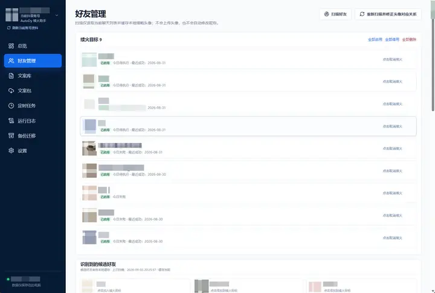
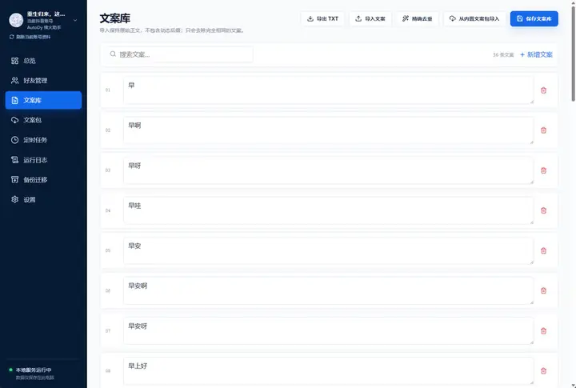
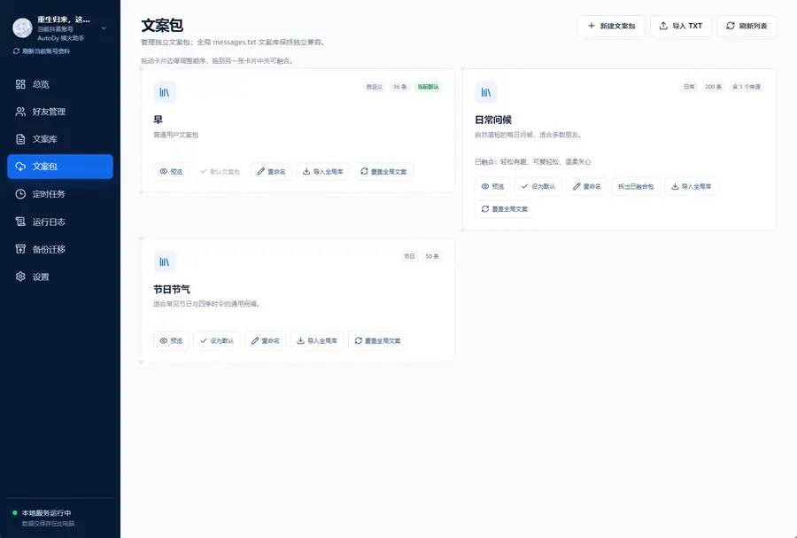
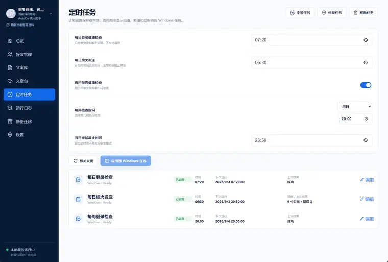
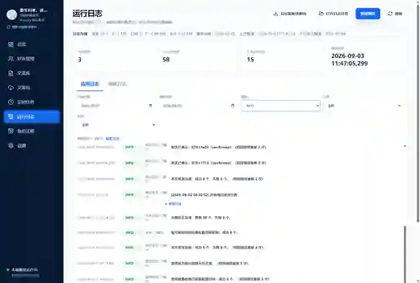
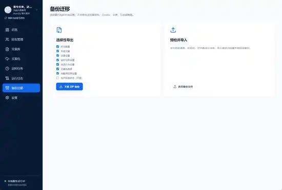
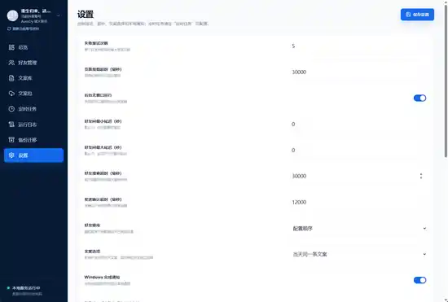

<div align="center">

# AutoDy

### Windows 本地抖音续火助手

把好友续火、文案、定时任务、运行结果和备份迁移放进一个本地 Dashboard 里管理。

<p>
  
  
  
</p>

[下载最新版](https://github.com/ACCXhub/XXhub/releases) · [安装与使用](docs/软件工程/10-安装部署与用户手册.md) · [项目文档](docs/软件工程/00-文档总览.md) · [更新记录](CHANGELOG.md)

</div>

---

## AutoDy 是什么

AutoDy 是一个面向 **Windows 桌面** 的本地化抖音续火工作流工具，用来把原本分散、重复的好友续火操作整理成一个可视化、可追踪、可迁移的本机工作流。

它把主要操作集中到一个 Dashboard 中：你可以管理续火好友、维护发送文案、配置文案包和 Windows 定时任务，也可以查看执行结果、运行日志并备份配置。

> **本地优先**：程序和用户数据以本机为中心运行与保存。发送链保持 fail-closed；只有好友身份、账号范围、会话定位和本次发送证据能够可靠确认时，系统才继续自动操作。

## 主要能力

| 模块 | 能力 |
| --- | --- |
| **好友管理** | 扫描好友、维护续火目标、候选好友、头像关系校正与最近执行状态 |
| **文案库** | 编辑、搜索、导入 / 导出 TXT、精简去重和保存全局文案 |
| **文案包** | 按主题维护独立文案包，设置默认包并与全局文案库互相导入 |
| **定时任务** | 配置每日续火、登录健康检查与每周检查，并应用到 Windows Task Scheduler |
| **运行日志** | 查看应用 / 调度日志、筛选执行结果、整理日志并导出脱敏诊断包 |
| **备份迁移** | 选择性导出本地设置和配置，导入前预检并支持迁移到新环境 |
| **设置** | 调整超时、重试、好友顺序、文案策略、通知和后台运行等行为 |

## 工作方式

```text
好友目标
   ↓
每日 / 每周任务
   ↓
身份与会话安全定位
   ↓
文案选择
   ↓
发送 + 发送确认
   ↓
当天状态 / 日志 / Dashboard
```

- 每日任务分母使用全部 enabled 目标；暂时不可安全执行只影响本次发送资格，不会提前把当天任务算作完成。
- 所有发送入口共用 today-delivery pipeline：可靠本地 `SENT` 直接跳过；其余目标只读 audit，`MISSING` 才进入既有安全发送 / 确认链，`UNKNOWN` 停止发送。
- `one_for_all` 文案包当天持久化同一 canonical 文案，retry / reconciliation 复用同一选择。
- 多账号本地隔离：账号级目标、计划、受管 browser profile 与 runtime snapshot。
- Windows Task Scheduler 是自动运行权威；Dashboard 常态非提升，仅 Scheduler 写操作使用一次性受约束 UAC。
- 托盘单实例、service identity 与动态端口；默认端口被占用时安全回退。

---

## 界面预览

当前 **1.5.4 Dashboard** 的主要页面如下。截图中的账号、头像和好友信息均已脱敏。

### 好友管理

管理续火目标、扫描候选好友，并查看目标状态与最近成功时间。



### 文案库

集中维护发送文案，支持搜索、TXT 导入导出、精简去重与直接编辑。



### 文案包

把不同风格或用途的文案拆成独立文案包，并设置默认包或同步到全局库。



### 定时任务

可视化配置每日续火、登录健康检查、每周检查与安全重试截止时间。



### 运行日志

按日期、级别、任务和状态筛选日志，查看任务结果并导出脱敏诊断信息。



### 备份迁移

选择需要备份的本地配置，导出 ZIP；导入前先进行预检和冲突检查。



### 设置

集中调整运行延迟、超时、失败重试、好友顺序、文案选择、通知和后台运行。



---

## 下载与安装

当前源码 / 发布版本线：**1.5.4**。

正式下载入口：**[GitHub Releases](https://github.com/ACCXhub/XXhub/releases)**

普通用户优先下载：

```text
AutoDy-Setup-1.5.4.exe
```

Release 同时提供：

```text
AutoDy-Setup-1.5.4.exe
AutoDy-Setup-1.5.4.exe.sha256
AutoDy-1.5.4-x64.msi
AutoDy-1.5.4-x64.msi.sha256
AutoDy-Windows-Portable-1.5.4.zip
AutoDy-Windows-Portable-1.5.4.zip.sha256
release-manifest.json
```

下载后可以用 PowerShell 校验 SHA-256：

```powershell
Get-FileHash -Algorithm SHA256 '.\AutoDy-Setup-1.5.4.exe'
```

结果应与同一 Release 中对应的 `.sha256` 文件一致。

### 默认位置

程序新安装优先使用：

```text
D:\AutoDy
```

D: 不可用时回退到：

```text
%LOCALAPPDATA%\Programs\AutoDy
```

用户数据独立保存在：

```text
%LOCALAPPDATA%\AutoDy
```

## 日常使用

1. 在 **好友管理** 中扫描并加入或重新关联续火目标。
2. 在 **文案库 / 文案包** 中维护本地文案以及默认 / 目标级 pack。
3. 在 **定时任务** 中配置每日续火和健康检查。
4. 在 **总览 / 运行日志** 中查看当天结果和需要处理的事项。
5. 出现“待核实”或 `uncertain` 时，使用现有只读诊断链重新核实；没有可靠证据时系统不会盲目补发。

首次 Douyin 登录只在 AutoDy 受管 Chromium 中完成，不复制日常浏览器 Cookie / profile。

## 卸载

1.5.4 安装后提供三个等价入口：

- 安装目录中的 `Uninstall AutoDy.exe`
- 开始菜单中的“卸载 AutoDy”
- Windows **设置 → 应用** 中的 AutoDy 卸载项

普通卸载会移除程序文件、快捷方式、安装注册和 AutoDy Windows Tasks，默认保留 `%LOCALAPPDATA%\AutoDy`。只有用户明确选择删除用户数据时才清理 DataRoot。

## 源码维护

当前开发 / 维护环境仍以源码仓库作为 canonical runtime：

```text
ProgramRoot = <repo>
Python      = <repo>\.venv\Scripts\python.exe
DataRoot    = %LOCALAPPDATA%\AutoDy
```

影响运行行为的修改完成后，按以下路径收口：

```text
修改源码 → focused validation → 重启源码实例 → 核验 service identity → 最小实际运行验收
```

MSI / Setup EXE / Portable 只在明确进行 Windows 分发或正式 Release 时构建。

## 文档

- [AutoDy 软件工程文档总览](docs/软件工程/00-文档总览.md)
- [安装部署与用户手册](docs/软件工程/10-安装部署与用户手册.md)
- [运维维护与故障排查](docs/软件工程/11-运维维护与故障排查.md)
- [隐私与安全设计](docs/软件工程/12-隐私与安全设计.md)
- [CHANGELOG](CHANGELOG.md)
- [Release Notes](docs/RELEASE_NOTES.md)
- [SECURITY](SECURITY.md)

---

<div align="center">
  <sub>AutoDy · Local-first Windows workflow for Douyin streak maintenance</sub>
</div>
