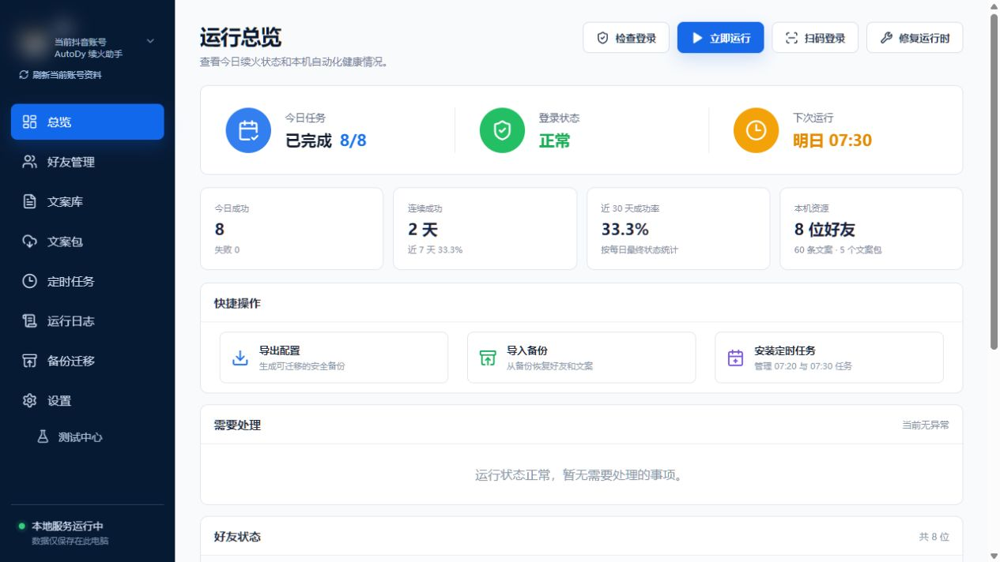
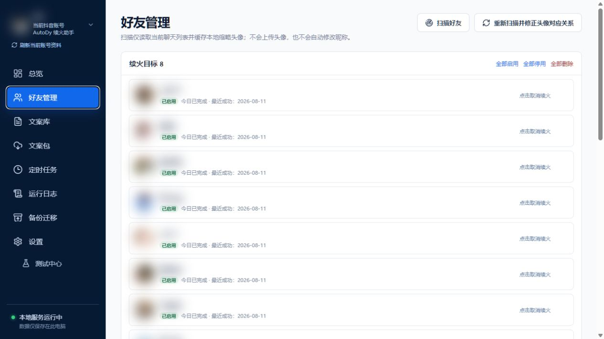
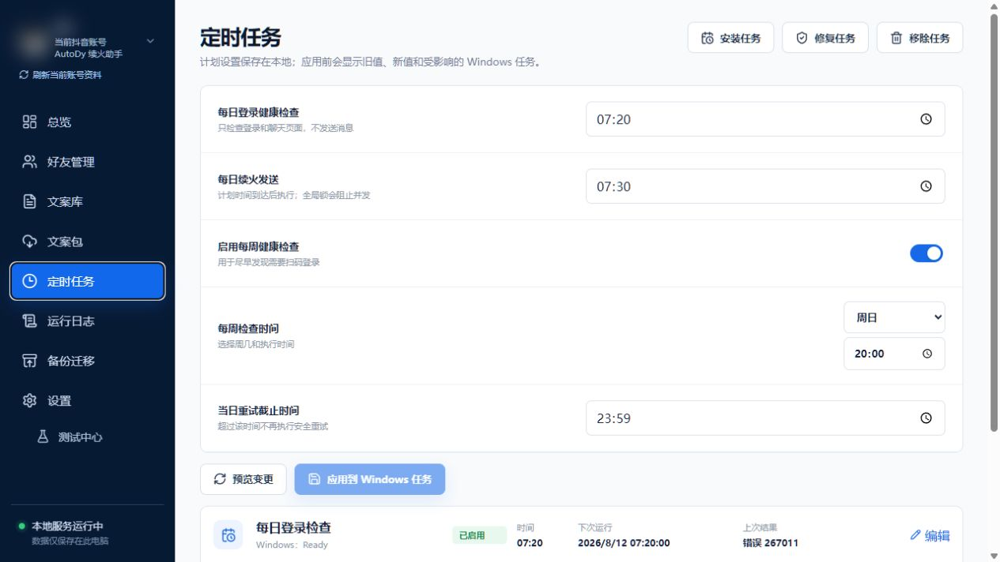

# AutoDy

AutoDy 是面向 Windows 的本机 Douyin 私信工作流管理台，用于管理续火目标、文案、计划、运行状态、历史、日志与备份。核心原则是：**不能证明安全就停止**。发送前必须验证稳定好友身份、账号范围、当前会话定位、重复状态和页面条件，并通过全局浏览器锁避免并发冲突。

## 当前版本状态

- 当前源码版本线与正式发布目标：**v1.5.2**。
- `v1.5.0` tag 的正式 workflow 在 MSI lifecycle acceptance 阶段失败且没有 GitHub Release；该标签保留为不可变历史。
- `v1.5.1` lifecycle 失败候选保留为不可变历史；`v1.5.2` 只有在正式 workflow 完成 source/build、MSI/Portable、privacy/package、manifest、publish 和 public asset reverify 后才属于公开稳定 Release；在此之前最后已确认稳定基线仍是 **v1.4.4**。

因此普通用户当前应从正式 Releases 使用已发布稳定资产；不要把 CI artifact、本地候选 MSI 或仅有 tag 的版本当作正式 Release。

## 主要能力

- 本地 Dashboard：总览、好友、文案、文案包、定时任务、日志、备份和设置。
- 好友 durable identity、账号范围、discovery candidate 与 conversation locator 分层；失效绑定通过显式重新关联恢复，不按昵称/头像猜测。
- 同日重复保护、发送确认、全局 browser lock；只有明确发生在发送前的失败可有限重试，`uncertain` 永不自动重试。
- 只读发送前自检（Preflight）：可打开会话和检查 DOM，但不输入、不准备、不发送消息。
- 多账号本地隔离：账号级目标、计划、受管 browser profile 和 runtime snapshot。
- Windows Task Scheduler 作为自动运行权威；Dashboard 非提升，Scheduler 写操作使用一次性受约束 UAC。
- 本机托盘单实例、service identity 与动态端口；8765 被无关程序占用时安全回退至 8766–8799，不结束对方进程。
- Watchdog 只恢复经验证的 AutoDy 服务：health 迟滞、graceful first、exact PID 再验证、3 次/10 分钟熔断、手动完整退出 suppression。
- standalone MSI/Portable：包含固定 Python、依赖、Chromium、生产前端和内置资源。
- Release pipeline：可重复构建、privacy/package、MSI lifecycle、manifest、公开资产重新下载与 hash 再验证。

## 截图

现有公开截图来自已安装 AutoDy v1.4.4 的只读导航，账号与好友信息已模糊处理。

### 运行总览



### 好友管理



### 定时任务



## 下载与安装

正式下载入口：<https://github.com/ACCXhub/XXhub/releases>

下载后先核对同一 Release 提供的 SHA-256 sidecar。例如：

```powershell
Get-FileHash -Algorithm SHA256 '.\AutoDy-<version>-x64.msi'
```

已确认 v1.4.4 MSI SHA-256：

```text
bea7a7e7495c0137d33463f504d2999dcef250e7df7766c90eb0dbcb4a1daa10
```

只有当 v1.5.2 Release 页面真正发布 `AutoDy-1.5.2-x64.msi`、checksum/Portable/manifest 且正式 workflow 全绿后，才把它视为正式升级资产。

MSI 新安装默认优先 `D:\AutoDy`；D: 不可用时回退到原交互用户 `%LocalAppData%\Programs\AutoDy`。用户数据位于原交互用户 `%LocalAppData%\AutoDy`，普通卸载删除程序、快捷方式和三项 Windows Tasks，但默认保留 DataRoot。

详细步骤见 [安装部署与用户手册](docs/软件工程/10-安装部署与用户手册.md)。

## 首次启动与登录

从桌面/开始菜单启动 AutoDy。托盘会发现或启动经验证的本机服务，并打开 `127.0.0.1:<selected-port>` Dashboard。

首次登录只在 AutoDy 受管 Chromium 中完成，不复制日常浏览器 Cookie/profile。登录过期时在受管窗口重新登录；退出/切换账号后旧好友绑定需要重新通过账号范围与权威 identity 证明。

## 日常使用

1. 在“好友管理”扫描并加入/重新关联续火目标。
2. 在“文案库/文案包”维护本地内容和默认/目标级 pack。
3. 在“定时任务”设置每日健康检查、每日续火和每周健康检查。
4. 用“总览/运行日志”查看今日结果、历史和需处理事项。
5. 对 `uncertain` 停止自动补发；对 safe pre-send failure 才使用产品提供的目标级安全重试。

关闭浏览器窗口不等于停止 Scheduler。显式“完整退出”才会抑制 watchdog 同日自动恢复服务。

## 本地数据与隐私

AutoDy 不要求把账号、目标、消息、Cookie、browser profile、日志或备份上传到 AutoDy 自有服务器。普通诊断/发布包应排除这些运行资料。

不要向支持人员发送完整 DataRoot、Cookie、browser profile、真实消息或未经审查的日志/截图。备份和日志中心提供受控导出边界。

## 故障排查

- Dashboard 未打开：从托盘重新打开，先确认 service identity，不按进程名批量结束 Python/Chromium。
- 8765 被占：允许 AutoDy 使用 8766–8799 的已验证回退端口。
- 好友要求重新关联：完整 discovery 后在 Friends 使用显式 relink，不按昵称直接覆盖绑定。
- `uncertain`：保留现场，不重复发送覆盖结果。
- Scheduler 失败：确认 UAC、snapshot read error/drift 和原用户 Principal/roots。
- MSI/Repair 失败：校验来源/hash、保存 verbose log，不删除 DataRoot。
- v1.5.2 资产尚未出现或 workflow 未全绿：继续使用最后已发布稳定版本，不下载 CI 中间包冒充 Release。

完整排障见 [运维维护与故障排查](docs/软件工程/11-运维维护与故障排查.md)。

## 软件工程文档

完整文档链入口：**[AutoDy 软件工程文档总览](docs/软件工程/00-文档总览.md)**。

- [01 可行性分析与项目概述](docs/软件工程/01-可行性分析与项目概述.md)
- [02 软件开发计划](docs/软件工程/02-软件开发计划.md)
- [03 软件需求规格说明书](docs/软件工程/03-软件需求规格说明书.md)
- [04 系统概要设计说明书](docs/软件工程/04-系统概要设计说明书.md)
- [05 详细设计说明书](docs/软件工程/05-详细设计说明书.md)
- [06 接口设计说明书](docs/软件工程/06-接口设计说明书.md)
- [07 数据字典与数据存储设计](docs/软件工程/07-数据字典与数据存储设计.md)
- [08 测试计划与测试用例说明](docs/软件工程/08-测试计划与测试用例说明.md)
- [09 测试与验收报告](docs/软件工程/09-测试与验收报告.md)
- [10 安装部署与用户手册](docs/软件工程/10-安装部署与用户手册.md)
- [11 运维维护与故障排查](docs/软件工程/11-运维维护与故障排查.md)
- [12 隐私与安全设计](docs/软件工程/12-隐私与安全设计.md)
- [13 项目开发总结报告](docs/软件工程/13-项目开发总结报告.md)

版本差异见 [CHANGELOG](CHANGELOG.md)，当前候选发布正文见 [RELEASE_NOTES](docs/RELEASE_NOTES.md)，安全说明见 [SECURITY](SECURITY.md)。

## 维护状态

AutoDy 当前重点是通过 v1.5.2 正式 Release 门禁并完成公开资产再校验。后续以阻断性可靠性、安全、安装/平台兼容维护为主；通用浏览器工作流研究不在本仓库扩展。

许可证见 [LICENSE](LICENSE)，第三方说明见 [THIRD_PARTY_NOTICES](THIRD_PARTY_NOTICES.md)。
