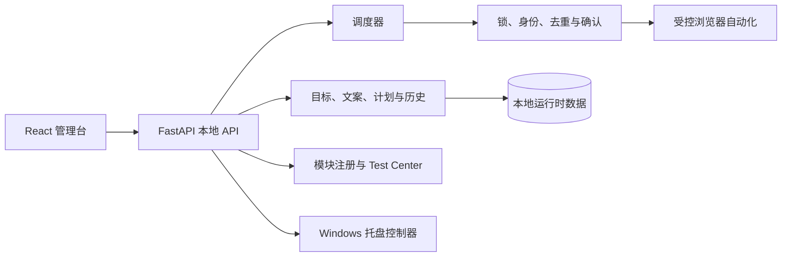
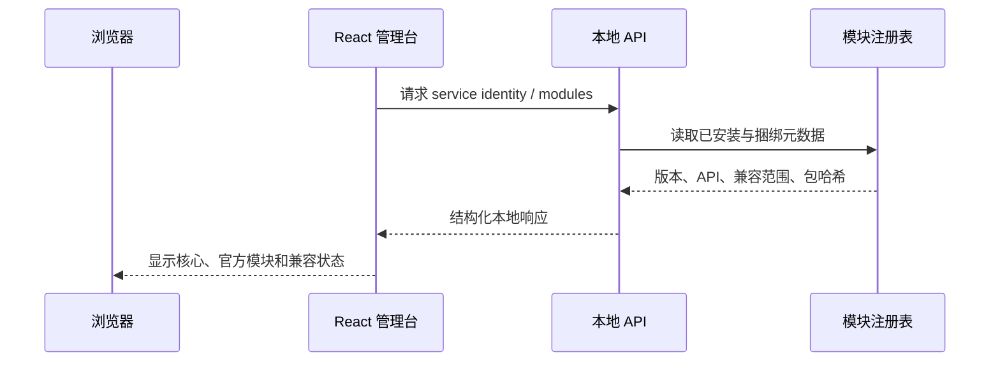
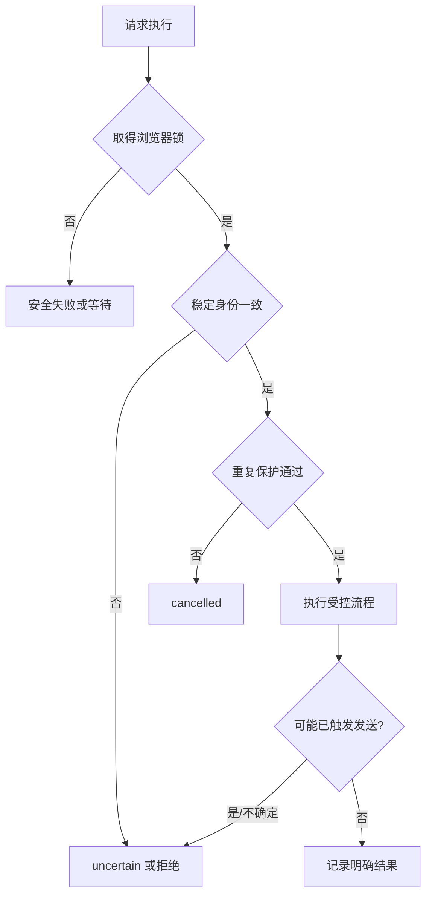
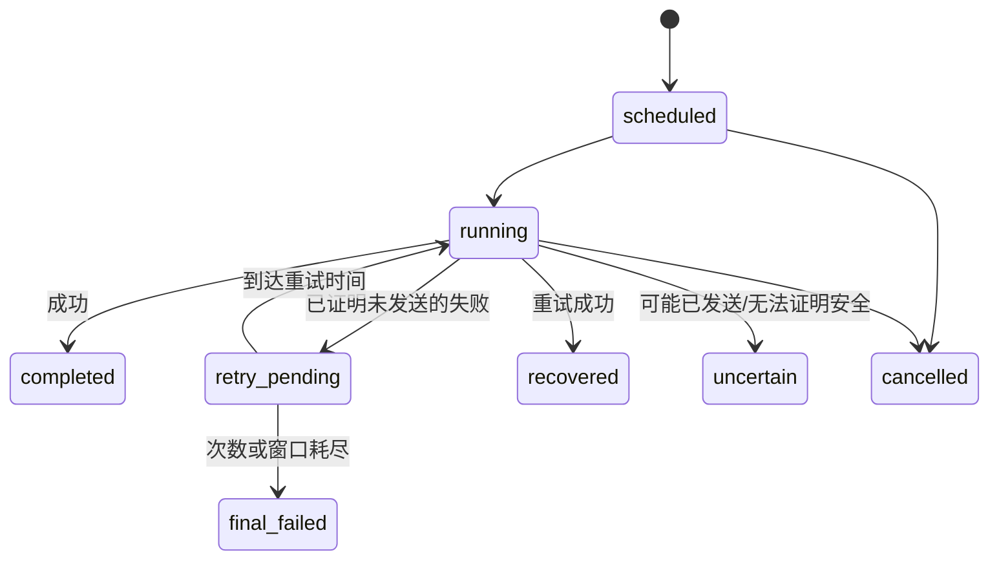
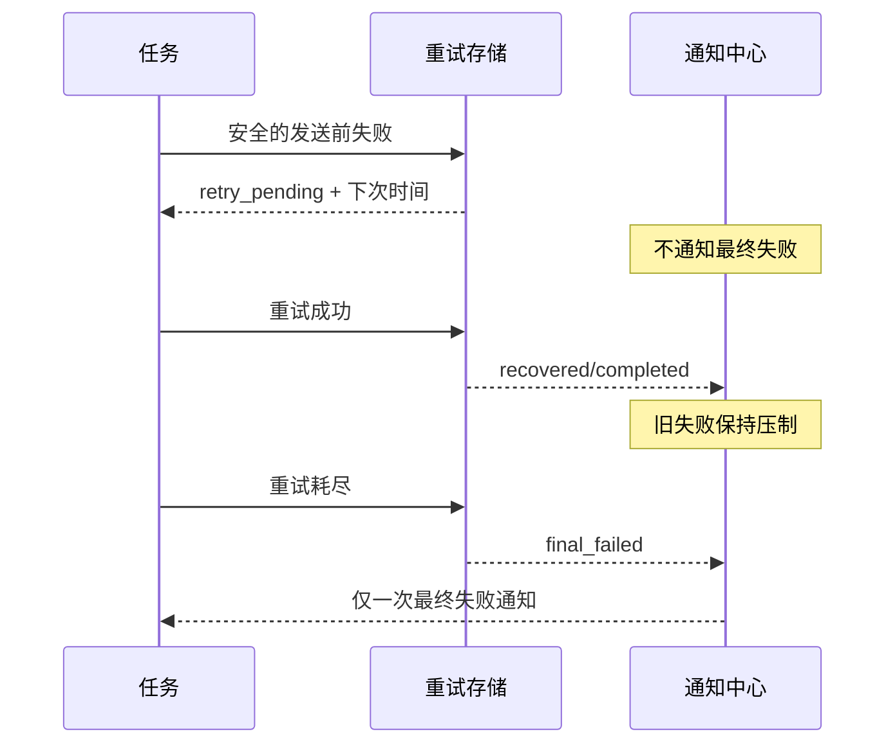
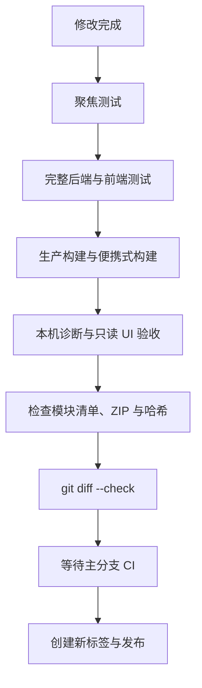

# AutoDy 工程手册

> 本手册面向开发、演示与维护；运行时数据、真实账号、消息、浏览器资料和日志均不属于文档范围。

## 1. 产品定位

AutoDy 是运行在 Windows 本机的 Douyin 私信工作流管理台。它将目标、文案、计划、执行历史和可选的 Test Center 放在本地服务中，浏览器自动化始终受身份校验、重复保护、确认和全局浏览器锁约束。

## 2. 版本与兼容性

当前核心版本为 `1.4.1`。官方 Test Center 的模块版本为 `1.2.0`，模块 API 为 `1`，兼容范围为 `>=1.3.0,<2.0.0`。核心版本与模块版本独立演进；模块不需要机械地追随核心版本号。

## 3. 产品边界

- 本项目不存储或公开真实账号、好友、消息、Cookie、浏览器配置或日志。
- 正常开发、测试、预检和导航验收不得输入、粘贴、准备、模拟或发送真实私信。
- Test Center 是可选的 Settings 子页；核心安全发送能力不依赖它。
- 计划任务可独立于托盘运行，托盘关闭不等同于停止服务。

## 4. 总体架构



## 5. 目录职责

| 路径 | 职责 |
| --- | --- |
| `src/autody/` | Python 领域逻辑、服务 API、浏览器安全边界、模块和调度。 |
| `frontend/` | React/Vite 管理台源码与前端测试。 |
| `tests/` | 单元、API 与浏览器夹具回归；夹具不使用真实站点内容。 |
| `scripts/` | Windows 启动、托盘、便携式构建与文档截图工具。 |
| `assets/icons/` | 应用和托盘使用的图标。 |
| `docs/screenshots/` | 经夹具生成的脱敏产品截图。 |

## 6. 本地服务和前端

前端调用本机 FastAPI 服务。生产构建由 Vite 输出到后端静态目录；开发时仍应使用项目 `.venv`，不得无提示地改用全局 Python。`/api/service-identity` 用于确认服务身份与核心版本，`/api/modules` 提供模块元数据。



## 7. 核心数据流

目标和文案由本地管理台维护，计划进入调度器后才会请求浏览器资源。执行记录使用任务运行 ID 关联，避免临时错误被当作最终失败重复通知。

## 8. 浏览器安全边界

浏览器访问遵循单一全局锁。进入会话前先取得稳定会话标识，且显示名称必须满足预期；身份不匹配时必须在聚焦或检查编辑器之前停止。重复保护与确认路径独立于 Test Center，避免可选模块影响核心安全。



## 9. 身份校验

`DouyinChat` 通过会话列表与已打开会话的稳定身份建立匹配，而不是只依据易变化的显示名称。身份歧义、页面状态异常或任何无法证明安全的情况都属于停止条件。

## 10. 重复保护与确认

执行前检查既有记录和本次目标，执行后使用可证明的结果更新历史。若无法证明未发生外发动作，系统将结果定为不确定而不是重试；这样优先避免重复发送风险。

## 11. 延迟安全重试

任务结果状态包括：`scheduled`、`running`、`retry_pending`、`recovered`、`completed`、`final_failed`、`uncertain`、`cancelled`。默认安全重试间隔为 2、5、10 分钟，并且不得越过任务允许完成窗口。



## 12. 可重试与不可重试条件

浏览器启动失败、登录在发送前不可用、浏览器忙、目标未找到、会话未打开、编辑器或发送控件在发送前缺失、以及发送动作前的页面失败可进入 `retry_pending`。发送控件可能已激活、存在外发消息可能、可能发送后的确认失败、身份歧义或重复保护不能证明安全时，必须立刻进入 `uncertain` 或相应终态，绝不重试。

## 13. 通知时机

`retry_pending` 期间不显示最终失败弹窗。重试成功写为 `recovered`/`completed` 并压制旧失败通知；耗尽安全重试后才产生一次 `final_failed` 通知。通知按任务运行 ID 和最终结果去重。



## 14. 重启恢复

`retry_pending` 为持久状态。应用重启后只恢复仍在允许窗口内、且此前明确判定为安全可重试的任务；绝不把 `uncertain` 转换为重试。

## 15. Test Center 的定位

Test Center 是官方可选模块，用于在真实页面上验证身份、导航和编辑器安全条件。它不是主导航入口，未安装时不挂载 iframe、不轮询模块接口，也不暴露可用路线。

## 16. 受控干跑

仅在用户明确发起、选择目标，并且已取得浏览器锁、导航验收通过、稳定会话标识与显示名称一致、编辑器为空且无附件时，才可进行受控干跑。干跑不得按 Enter、点击发送、调用发送管道或创建发送尝试；临时输入只在内存中使用，必须仅清理自身未改变的内容并确认编辑器恢复为空。任何草稿、附件、身份不一致、清理歧义或不确定状态都应保留现场并停止。

## 17. 模块包与元数据

模块清单声明模块 ID、版本、API 和核心兼容范围。安装器使用原子升级，注册表记录已安装包。捆绑 ZIP 只能来自当前生成包；启动与更新后须比较核心、清单和包哈希，清除相关的陈旧模块元数据缓存，并在诊断中暴露加载路径和哈希。

```mermaid
flowchart LR
  B[当前模块构建源] --> Z[生成 Test Center ZIP]
  Z --> M[ZIP 内 manifest]
  Z --> P[应用捆绑模块目录]
  P --> R[已安装模块注册表]
  R --> A[/api/modules]
  M --> V{版本/API/哈希一致?}
  V -- 否 --> E[可见可操作错误]
  V -- 是 --> A
```

## 18. 模块版本显示

设置页应分别显示 AutoDy 核心版本、官方模块版本和兼容状态。例如 AutoDy `1.4.1` 与 Test Center `1.2.0` 且范围 `>=1.3.0,<2.0.0` 是正常兼容组合，不表示模块“落后”。

## 19. Windows 托盘控制器

`scripts/autody-tray.ps1` 提供一等公民托盘宿主，使用单实例锁，启动或监督已验证的本地服务。它仅在确认 8765 服务属于 AutoDy 后复用或停止该服务，绝不接管无关进程。托盘状态覆盖启动中、运行正常、正在安全重试、需要处理和已停止。

## 20. 托盘菜单与所有权

菜单提供打开管理台、查看状态、日志、重启、开机启动开关、退出托盘和退出并停止 AutoDy。普通退出不会删除计划任务或用户数据；“退出并停止”仅可停止托盘确认管理的服务。计划任务本身不依赖托盘。

## 21. 安装、启动与便携式构建

开发环境使用项目 `.venv`。源安装可以构建前端；便携式安装不要求终端用户具备 Node.js。per-user MSI 默认将只读程序安装到 `%LocalAppData%\Programs\AutoDy`，向导允许改选程序目录，并持久化该路径供修复和卸载使用；可写数据固定放在 `%LocalAppData%\AutoDy`，默认在卸载时保留。MSI 使用固定 SHA-256 的官方 Python embeddable、固定依赖和 clean Chromium staging，不复制开发 `.venv`，也不递归打包仓库。`install.cmd`、仪表盘启动脚本和构建脚本必须保持 PowerShell 5.1 与 MSI 兼容，且任何启动失败应可见、可诊断。

## 22. 诊断与陈旧安装

排查版本异常时，先确认监听 `127.0.0.1:8765` 的 PID、可执行文件、命令行、工作目录、父进程、解释器、导入包路径、静态目录和模块 ZIP 路径/哈希，再查看 `/api/service-identity` 与 `/api/modules`。只有当 API 已返回正确版本时，才考虑浏览器缓存；若 API 返回旧模块版本，根因是实际启动源或模块包。

## 23. 测试策略

后端使用 pytest 覆盖状态机、API、模块包、托盘所有权和浏览器安全分支；前端使用 React/Vitest 覆盖页面显示与交互；生产构建验证静态资产。浏览器测试只能使用假页面、夹具或只读检查，不能操作真实私信编辑器。

## 24. 验证命令

```powershell
.\.venv\Scripts\python.exe -m autody.cli doctor
.\.venv\Scripts\pytest.exe -q
cd frontend
npm test
npm run build
cd ..
.\scripts\build-portable.ps1
.\scripts\build-msi.ps1
.\scripts\verify-msi-lifecycle.ps1
.\scripts\verify-release-artifacts.ps1
```

UI 变更还应在新的浏览器上下文中访问 `127.0.0.1:8765`，检查请求、控制台、弹窗、滚动和常见桌面宽度；该验收不得触发真实消息操作。

## 25. 发布与维护清单



不得移动、删除或强制更新已发布标签；不得强推；不得提交运行时数据、`.venv`、`node_modules`、日志、缓存、模块注册表或私有截图。现有已发布标签（包括 `v1.4.0`）均不可变，后续版本需在 CI 通过后使用新标签。
