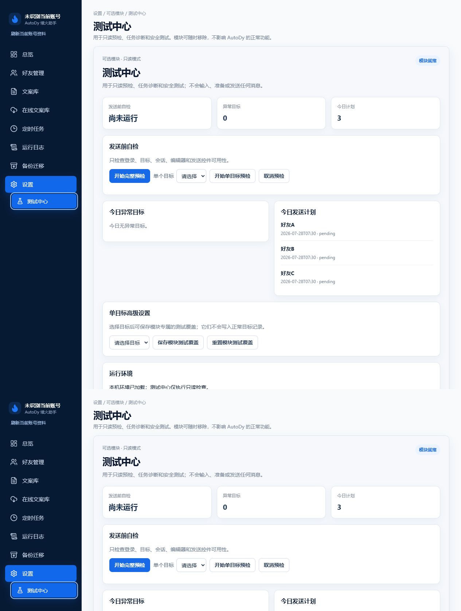
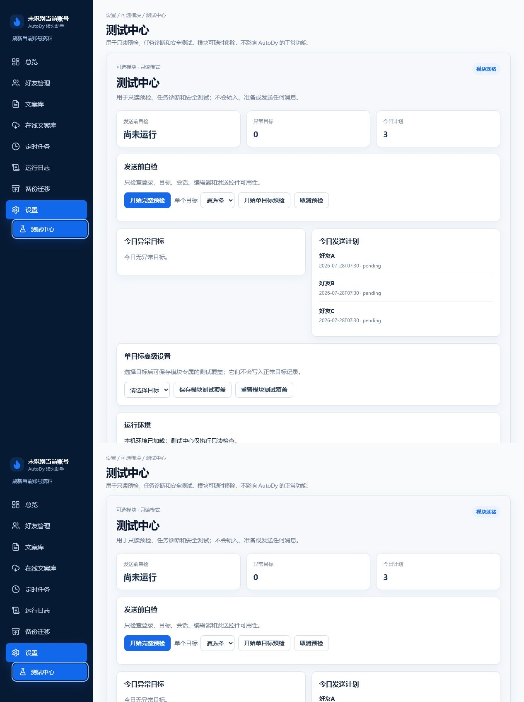
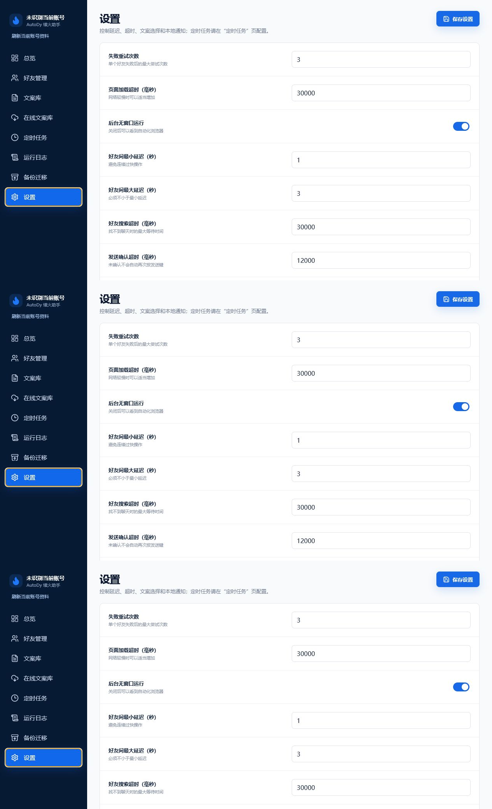

# 测试中心指南

测试中心用于只读预检、异常目标和计划诊断。它绝不输入、粘贴或发送消息；预检只检查登录、目标身份、会话、编辑器和发送控件。

图：测试中心使用完整 Settings 工作区，并通过受验证高度同步避免嵌套滚动。

图：单目标和完整预检仅产生模块目录内的历史和进度。

图：确认会永久删除测试历史、设置、覆盖、夹具、进度和模块日志；正常好友、文案、发送记录、浏览器资料均保留。

图：移除后子导航、iframe、模块轮询、CSS、脚本和路由均不可用；重新安装从干净状态开始。
