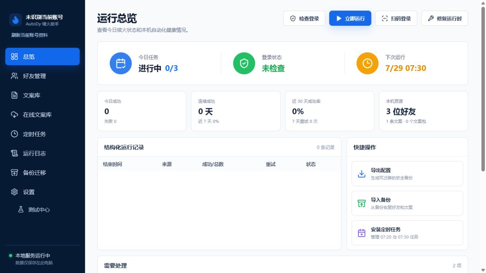
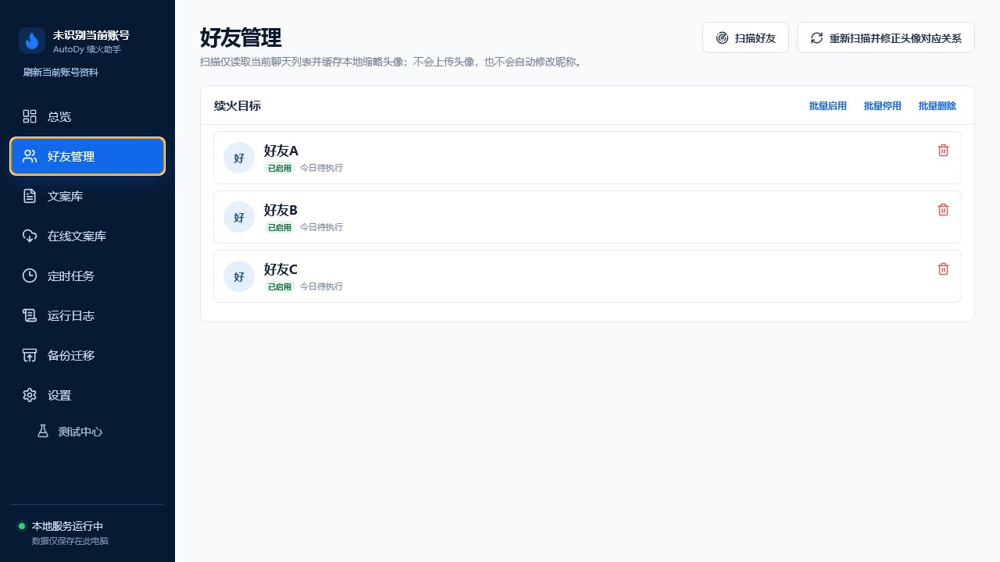

# 用户指南

AutoDy 的日常页面包括总览、好友管理、文案库、定时任务、日志、备份迁移和设置。普通页面不加载测试中心；请在“设置 > 可选模块”安装后，从“设置 > 测试中心”进入。

图：使用“演示账号”和虚构状态的总览；用于查看本机任务健康度。

图：紧凑删除图标位于卡片布局流外；候选好友区域不参与测试模块功能。

图：从设置安装官方模块。卸载入口只位于测试中心底部的“模块管理”。备份和迁移不会包含浏览器资料或账号数据。
