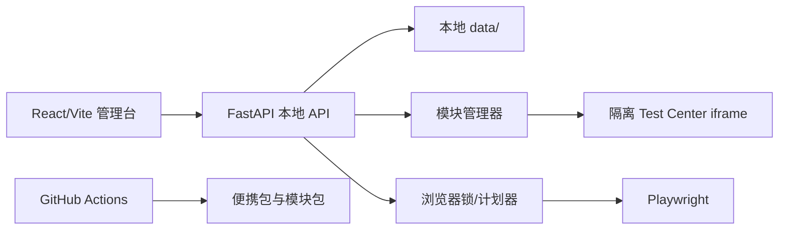

# 系统架构

```mermaid
flowchart LR
 UI[React/Vite 管理台] --> API[FastAPI 本地 API]
 API --> DATA[本地 data/]
 API --> MOD[模块管理器]
 MOD --> IFRAME[隔离 Test Center iframe]
 API --> LOCK[浏览器锁/计划器]
 LOCK --> PW[Playwright]
 CI[GitHub Actions] --> PKG[便携包与模块包]
```

FastAPI 提供本地 API，React 负责 UI，Playwright 仅由核心受锁管线调用。测试中心 iframe 与宿主同源但样式隔离；`postMessage` 只接受已验证来源、frame、模块 ID 与高度范围。
