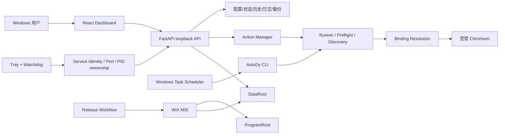

# AutoDy 系统概要设计说明书

## 1. 设计目标

AutoDy 的系统设计围绕四个目标：本地运行、可验证身份、失败可诊断、恢复不误伤。UI 不直接控制真实浏览器；端口、PID、显示名和一次页面读取都不能单独成为业务身份依据；安装器与运行时明确区分 ProgramRoot 和 DataRoot。

## 2. 技术组成

- Python 3.11+：领域逻辑、CLI、本地服务、状态、浏览器编排。
- FastAPI：loopback 本地 API 与生产前端静态资源。
- Pydantic/PyYAML：配置与请求模型。
- Playwright/Chromium：受管浏览器会话。
- React/Vite：Dashboard。
- PowerShell 5.1：托盘、Scheduler、runtime root 解析、构建/验证。
- WiX 7：Windows MSI。
- GitHub Actions：普通 CI 与正式 Release validation。

正式 MSI/Portable 携带固定 Python、依赖、Chromium 和生产资源，用户不需要系统 Python/Node/npm。

## 3. 逻辑架构

核心约束：

- UI 只通过本地 API 请求动作，不能直接调用浏览器输入/发送。
- 浏览器写动作必须经过锁、稳定绑定和发送状态机。
- Preflight 只有只读 DOM 检查能力，不依赖 sender。
- 托盘/watchdog 只管理经过 service identity + 本机进程事实重新验证的服务。
- Scheduler 是自动运行权威，托盘不是计划执行的唯一载体。

## 4. 运行根与分发模式

| 概念 | Source | MSI installed | Portable |
| --- | --- | --- | --- |
| ProgramRoot | 仓库根 | 实际 `INSTALLFOLDER` | 解包根 |
| DataRoot | 仓库根/配置根 | 原交互用户 `%LocalAppData%\AutoDy` | 解包根 |
| Python | `.venv\Scripts\python.exe` | `runtime\python\python.exe` | `runtime\python\python.exe` |
| Chromium | DataRoot 下开发 runtime | ProgramRoot `runtime\ms-playwright` | ProgramRoot `runtime\ms-playwright` |
| Browser profile | 配置解析路径/账号目录 | DataRoot 下账号隔离目录 | 解包/DataRoot 下账号目录 |
| 前端 | Vite dev 或包内静态资源 | Python 包内 `web/static` | 同左 |

PowerShell 共享 resolver 负责分发模式、ProgramRoot、DataRoot、Python 与 BrowserRoot；Python 运行时消费启动层显式设置的 roots，不自行根据管理员环境重新推断用户数据位置。

## 5. 配置与持久化架构

AutoDy 不使用关系数据库。持久化由以下类型组成：

- `config.yaml`：产品配置与 Target。
- `messages.txt`、文案包目录：本地消息内容。
- JSON：状态、账号资料、好友 discovery、retry outcome、各种轻量运行状态。
- JSONL：任务运行历史、preflight 历史、模块历史、日志。
- PNG：本地头像缓存。
- 浏览器 profile：受管 Chromium 登录状态。
- Windows Registry：MSI 安装路径/DataRoot/版本等安装事实。
- Windows Task Scheduler：三项自动任务。

完整字段、owner、敏感级别和生命周期见 07。

## 6. 好友身份与绑定设计

AutoDy 明确区分三个概念：

1. **Target `stable_id`**：AutoDy 内部持久目标 ID。
2. **durable friend proof**：`binding_account_scope + binding_identity_source + binding_identity_key`，证明“是哪一个好友”。
3. **current locator/candidate**：`candidate_id` / 当前 `conversation_id`，帮助定位这次 discovery 中的会话，不等于永久好友身份。

`binding_recovery.resolve_stable_binding` 是运行时权威解析入口；显式重新关联由 `reassociate_stable_binding` 写回。自动/显式恢复只接受当前完整 discovery 中唯一、账号范围匹配、candidate 未被占用且 identity source 权威的候选。显示名、头像或单纯 candidate_id 都不能作为 durable proof。

## 7. 浏览器与发送状态设计

Runner 先取得可执行 Target 集合，再解析当前 binding/locator。发送路径使用全局 browser lock；Chat 负责打开预期 conversation、检查编辑器/发送条件、执行发送并确认。

运行终态包括：`already_done`、`completed`、`retry_pending`、`recovered`、`final_failed`、`uncertain`、`cancelled`。只有明确“发送动作尚未发生”的失败能进入有限重试；发生发送尝试但确认失败、身份不确定或状态未知时进入 `uncertain`，不能自动重试。

Preflight 使用 `ReadOnlyPage/ReadOnlyLocator` 受限包装：可读取 DOM、滚动列表、打开 conversation 行，但没有 `fill/type/press/send` 通用能力；持久证据中这些写动作计数应为 0。

## 8. Scheduler 与权限设计

Windows Task Scheduler 是自动运行权威。默认三项任务：每日健康检查、每日续火、每周健康检查。Principal 使用原交互用户且 `RunLevel Limited`。

Dashboard 正常非提升；只有安装/更新/修复/移除 Scheduler 时调用受约束 UAC 子进程。提升前捕获原用户 SID、ProgramRoot、DataRoot；提升后的管理员环境不能重新推断这些值。Scheduler 快照“成功且空”与“查询失败”严格区分，注册后瞬时读取失败允许有限重试，真实 drift 仍阻断。

## 9. 托盘、服务身份与 watchdog

托盘持有单实例入口，按持久化端口提示、8765、8766–8799 探测本机服务。HTTP 可达不代表可复用；还需结合 application/version、用户、ProgramRoot/package path、Python executable 和进程快照判断归属。

watchdog 的恢复边界：

- 受管进程意外退出可自动重启；
- 进程仍存在但 health 连续失败约 15–20 秒才判定无响应；
- 优先正常退出；强制终止前重新验证具体 PID 的 AutoDy service identity；
- 10 分钟最多 3 次自动恢复，之后熔断并进入 needs-attention；
- 用户明确“完整退出”抑制同日自动恢复；普通重启不视为手动停止；
- 自动恢复不得发送、扫描好友、修复 Scheduler 或改变无关 DataRoot。

## 10. 多账号设计

`MultiAccountStore` 在 `data/account-profiles/` 保存注册表和账号级快照。当前激活账号仍投影到兼容 working set，使既有 Runner/API 使用稳定路径；切换前保存当前账号设置与 runtime，再清理 working set 并恢复目标账号快照。

账号切换/添加/退出与真实发送、dry-run 和浏览器 action 互斥。首次从 legacy 单账号结构迁移时创建 migration backup/rollback manifest；迁移失败恢复配置和 browser profile。

## 11. 安装器设计

MSI 使用 per-machine 安装语义，同时把 DataRoot 固定到原交互用户。新装优先 `D:\AutoDy`，不可用时回退 `%LocalAppData%\Programs\AutoDy`，也允许用户选择明确目录。

普通卸载删除 ProgramRoot、快捷方式和 AutoDy Scheduler tasks，默认保留 DataRoot。1.4.0–1.4.2 per-user 到 1.4.3+ per-machine 需要 scope migration；旧产品登记/程序先正常移除，Permanent DataRoot 保留，再安装新包。

MSI lifecycle acceptance 会真实执行 fresh install、Repair、默认卸载、自定义路径安装/卸载、上一稳定版本迁移/升级和最终卸载，并验证 payload、任务、快捷方式和 DataRoot。

## 12. Release 架构

普通 CI 只执行常规 Python、frontend 和 PowerShell 解析。正式 tag Release 执行：

`历史标签/上一 MSI 校验 → release_build tests → clean-source portable/MSI → privacy/package verifier → MSI lifecycle → manifest → publish → re-download public assets → 再验 hash/MSI/privacy`。

Release 的 source/build、MSI/Portable、privacy/package、manifest 任一步失败都不应执行后续公开发布；hosted-runner lifecycle 失败仅记录诊断。v1.5.0/v1.5.1 因 lifecycle 候选失败而未发布；当前 v1.5.2 不继承旧候选的部分结果。

## 13. 扩展边界

当前维护应沿现有模块边界增强 AutoDy，不在仓库内扩展云端、多租户或通用 BrowserWeave 架构。新增数据类型应先确定 owner 和 DataRoot 路径；新增 API 应同步 06；新增状态应同步 07；新增安全/发送路径必须更新 03、05、08、12。
